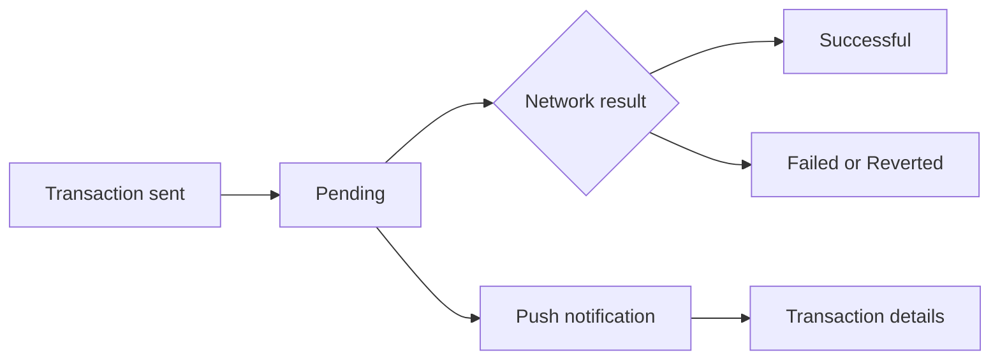
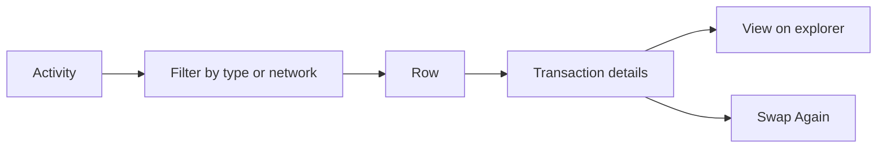

# Transactions

The Activity tab: everything the wallet sent, received, swapped or staked, grouped by day, with every pending transaction tracked until the network settles it.

- Activity lists transactions newest first under Today, Yesterday or the date, each with its type (Sent, Received, Swap, Stake and so on), the asset, the amount and its value, and a Pending badge while it is unconfirmed; filters narrow by type and network.
- A pending transaction is tracked in the background, even after the app is closed, and its status and the balances update when the network confirms it.
- Transaction details show the header with the amount and value, Date, Status, Recipient or Sender, the network fee, a memo when there is one, and "View on" the explorer; a swap shows its progress and offers Swap Again.
- A push about a transaction opens its details.
- An empty wallet reads "Your activity will appear here. Make your first transaction".

## Rules

- A sent transaction appears as Pending at once and stays tracked until the network settles it, whatever screen the user is on.
- Amounts and status come from the network, never from the app's guess; a failed or reverted transaction is shown as such.
