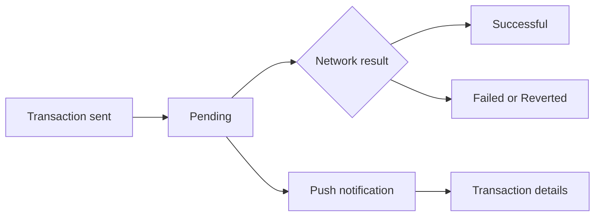
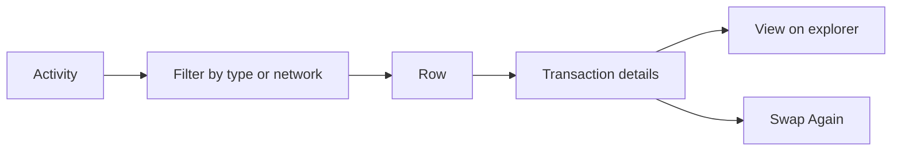

# Transactions

The Activity tab: everything the wallet sent, received, swapped or staked, grouped by day, with every pending transaction tracked until the network settles it.

1. Activity lists transactions newest first under Today, Yesterday or the date, each with its type (Sent, Received, Swap, Stake and so on), the asset, the amount and its value, and a Pending badge while it is unconfirmed; filters narrow by type and network.
2. A pending transaction is tracked in the background, even after the app is closed, and its status and the balances update when the network confirms it.
3. Tapping a row opens Transaction details: the header with the amount and value, Date, Status, Recipient or Sender, Network Fee, a memo when there is one, and "View on" the explorer; a swap shows its progress and offers Swap Again.
4. A push about a transaction opens its details.

## Expected results

| When | Expected | Why |
|---|---|---|
| A transaction is sent | a Pending row at once, tracked until the network settles it, whatever screen the user is on | |
| The network settles it | Successful, or Failed or Reverted | amounts and status come from the network, never from the app's guess |
| Transaction details show the fee | Network Fee in the user's currency, as on Confirm: `$0.01`; without a price, the coin amount: `0.000021 ETH` | the fee the user approved reads the same afterwards |
| The user taps Network Fee | the fee in its coin above its value: `0.000021 ETH` over `$0.01` | |
| A swap | listed under both the asset paid and the asset received | the user looks for it under either |
| The wallet switches while details are open, such as a push for another wallet | the details stay on the wallet they were opened for | an open details screen never blanks or swaps |
| The user taps an address | its page, with the name the user already sees for it: a contact or own wallet name first, a contact's picture or initials as on Confirm, a token's or validator's logo | the address is recognisable |
| The address page opens | the full address, copied with a tap, the type and the balances | |
| The address is flagged | "Suspicious address" under its picture, the same warning as on Confirm, even for a contact | |
| The address is a contract, token or validator | no Balances section, not even while the page loads | they are not fetched for anything but a plain address |
| The address is a contact or own wallet that the network reports as a plain address | its balances | the rule follows the network's type, not the local label |
| The wallet has no transactions | "Your activity will appear here. Make your first transaction" | |

## Platform differences

| When | iOS | Android | Expected |
|---|---|---|---|
| A transaction is deleted while its details are open | the details keep showing it | the details clear | Android matches iOS (BD375) |
