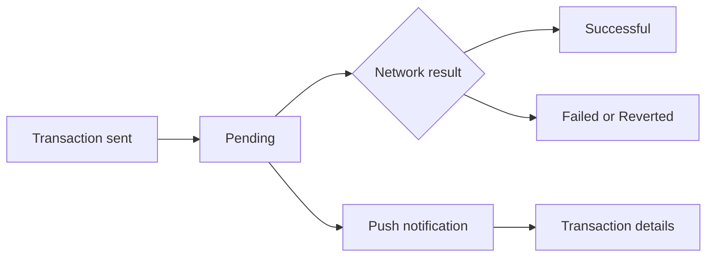
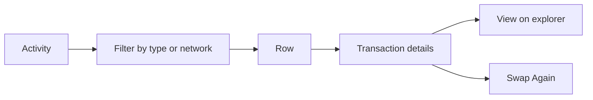

# Transactions

The Activity tab: everything the wallet sent, received, swapped or staked, grouped by day, with every pending transaction tracked until the network settles it.

```mermaid
flowchart LR
    A[Transaction sent] --> B[Pending] --> C{Network result}
    C --> D[Successful]
    C --> E[Failed or Reverted]
    B --> F[Push notification] --> G[Transaction details]
```

1. Activity lists transactions newest first under Today, Yesterday or the date, each with its type (Sent, Received, Swap, Stake and so on), the asset, the amount and its value, and a Pending badge while it is unconfirmed; filters narrow by type and network.
2. A pending transaction is tracked in the background, even after the app is closed, and its status and the balances update when the network confirms it.
3. Tapping a row opens Transaction details: the header with the amount and value, Date, Status, Recipient or Sender, Network Fee, a memo when there is one, and "View on" the explorer; a swap shows its progress and offers Swap Again.
4. A push about a transaction opens its details.

```mermaid
flowchart LR
    A[Activity] --> B[Filter by type or network] --> C[Row] --> D[Transaction details] --> E[View on explorer]
    D --> F[Swap Again]
```

## Expected results

| When | Expected | Why |
|---|---|---|
| A transaction is sent | a Pending row at once, tracked until the network settles it, whatever screen the user is on | |
| The network settles it | Successful, or Failed or Reverted | amounts and status come from the network, never from the app's guess |
| Transaction details show the fee | Network Fee in the user's currency, as on Confirm: `$0.01`; without a price, the coin amount: `0.000021 ETH` | the fee the user approved reads the same afterwards |
| The user taps Network Fee | the fee in its coin above its value: `0.000021 ETH` over `$0.01` | |
| A swap | listed under both the asset paid and the asset received | the user looks for it under either |
| The wallet switches while details are open, such as a push for another wallet | the details stay on the wallet they were opened for | an open details screen never blanks or swaps |
| A transaction is deleted while its details are open | the details keep showing it | an open details screen never blanks or swaps |
| The user taps an address | its page, with the name the user already sees for it: a contact or own wallet name first, a contact's picture or initials as on Confirm, a token's or validator's logo | the address is recognisable |
| The address page opens | the full address, copied with a tap, the type and the balances | |
| The address is flagged | "Suspicious address" under its picture, the same warning as on Confirm, even for a contact | |
| The address is a contract, token or validator | no balances | they are not fetched for anything but a plain address |
| The wallet has no transactions | "Your activity will appear here. Make your first transaction" | |

## Push notifications

A settled transaction pushes to every device subscribed to the wallet. A failed one pushes only to the sender, naming the action with the same word as the successful push; a failed incoming transaction pushes nothing, because nothing arrived.

| Type | Successful | Failed or Reverted |
|---|---|---|
| Transfer, sent | 💸 Sent: 1 SOL To 7YjV…RACA | ❌ Transfer: Failed To 7YjV…RACA |
| Transfer, received | 💰 Received: 1 SOL From 7YjV…RACA | no push |
| NFT, sent | 🖼️ Sent NFT: #1234… To 7YjV…RACA | ❌ Transfer: Failed To 7YjV…RACA |
| NFT, received | 🖼️ Received NFT: #1234… From 7YjV…RACA | no push |
| Swap | 🔄 Swap from USDC to SOL 1 USDC > 0.0084 SOL | ❌ Swap: Failed |
| Token approval | ✅ Token Approval USDC To Uniswap | ❌ Token Approval: Failed |
| Stake | 🔒 Stake 10 SOL To Everstake | ❌ Stake: Failed |
| Unstake | 🔒 Unstake 10 SOL From Everstake | ❌ Unstake: Failed |
| Redelegate | 🔄 Redelegate 10 SOL To Everstake | ❌ Redelegate: Failed |
| Claim rewards | 🎁 Claim Rewards 0.1 SOL | ❌ Claim Rewards: Failed |
| Withdraw, stake or earn | 🔓 Withdraw 10 SOL From Everstake | ❌ Withdraw: Failed |
| Earn deposit | 🔒 Stake 10 USDC To Yo | ❌ Stake: Failed |
| Freeze, Unfreeze | Freeze 10 TRX, Unfreeze 10 TRX | ❌ Freeze: Failed, ❌ Unfreeze: Failed |
| Contract call | 💸 Sent: 0.5 SOL To JUP6…TaV4 | ❌ Smart Contract: Failed |
| Perpetual open, close | 📈 Long BTC Entered at $65,000 🚀; 📉 Short BTC You made $12 💰 | no push; only filled Hyperliquid orders are recorded |
| Asset activation, perpetual modify | no push | no push |

The second line is the push body; a failed swap, approval, stake action or contract call has none. A failed transfer says Transfer rather than Sent, because nothing was sent.
