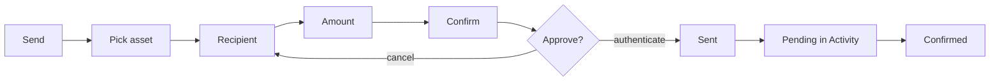
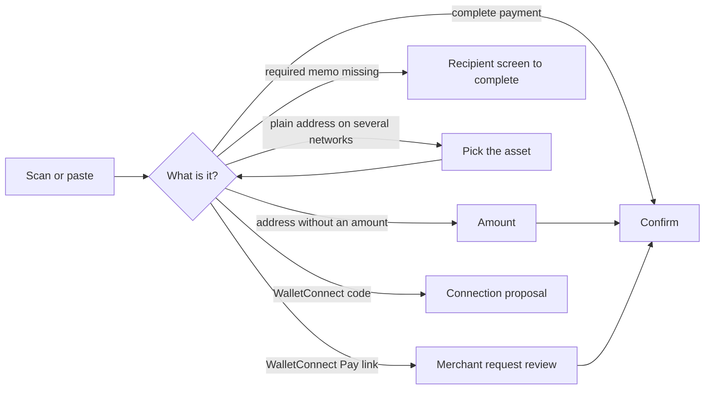

# Transfer

Send an asset to an address, a name or a contact, or pay a scanned QR code or payment link, with one confirmation screen that shows everything before it is signed.

## Send

1. The user taps Send on the wallet screen or an asset and picks the asset to send.
2. Recipient: the user pastes or types an address or a name, scans a QR code, or picks a contact or one of their own wallets; a memo field appears on networks that use one.
3. Amount: the user types in crypto or in fiat and switches between them, or taps Max, which keeps the network fee back on a native coin; the available balance is shown.
4. Confirm shows the amount with its value, the recipient with its name when known, the network, the Network Fee, the wallet, and any warning from the simulation of the transaction.
5. The user confirms with the device's authentication; the transaction is sent and the app returns to where Send started.
6. The transaction appears at once as Pending in Activity and on the asset, and its balance updates when the network confirms it.

| When | Expected | Why |
|---|---|---|
| A typed name is registered for the network | it resolves while typing to that address | |
| A typed name is not registered, or has no address for the network | not found | a name never becomes an empty or zero address |
| The name service cannot be reached | an error, not a missing name | |
| The fee's coin has a price | Network Fee shows its value only: `$0.01` | the value is the number the user weighs |
| The fee's coin has no price | the fee in that coin: `0.000021 ETH` | |
| There is not enough of the coin that pays the fee | the fee in that coin above its value: `0.0000129 BNB` over `$0.01` | that is the amount the user has to add |
| The user can pick which asset pays the fee | its value and the asset: `$0.01` with `USDC` | |
| The user taps Network Fee | the fee in its coin above its value, and faster, slower or custom fees where the network allows | |
| The recipient is flagged | a "Suspicious address" warning with one line on why, under the amount; Confirm stays disabled | |
| Confirm loads with a problem the user can act on: not enough balance or network fee, a required memo, a risky transaction | its explanation opens by itself | the user sees what to do before looking for it |
| A refresh or a fee change finds the same problem | the explanation stays as the user left it | it opens once per problem |
| Retry, or a different problem | the explanation opens again | |
| Any other load error | it stays in the error row | |
| The simulation cannot answer | sending is not blocked | |
| The simulation finds a risk | the risk shows before the user confirms | |
| The simulation predicts balance changes | every digit of each amount, never rounded | what the user approves is exactly what moves |
| The network rejects the sent transaction | the network's own reason | it is often the only explanation there is |
| A Dash payment is sent | Pending until the transaction is mined | the network may lock it with InstantSend, but the provider does not report that lock yet |

## Scanned codes and payment links

Supported codes: a plain address; Bitcoin, Litecoin, Bitcoin Cash, Dogecoin, Dash and Zcash payment codes (amount, memo, label); XRP with a destination tag; Ethereum coin and token transfers; Solana Pay; TON transfers with a comment; WalletConnect Pay links. The scanner reads them from the camera or a picked image.

| When the code is | Expected | Why |
|---|---|---|
| A complete payment: asset, amount and, where required, memo | Confirm opens directly | nothing is left to ask |
| An address without an amount | the amount screen | |
| An amount with more decimals than the asset has | the amount screen, with the amount dropped | an amount is never rounded |
| A payment code's amount | the amount field in the device's number format, with its exact value | "0.001" read with a comma decimal separator would become 1 |
| For a network that uses a memo, without one | the recipient screen | |
| An address that is not valid for the asset | the recipient screen | |
| A plain address that matches several networks | a pick of the asset to send, then the rows above | |
| A WalletConnect Pay link | a review of the merchant's request; once confirmed, it pays and reports the result back to the merchant | |
| A code the app cannot read | "Not supported" | a scan never does nothing |
| A code the app can read but not open: a network without an account, a payment link that fails | why it cannot open | |

## Platform differences

None recorded.

## Rules

- Nothing is signed or sent without the confirmation screen showing the amount, recipient, network and fee, because that screen is what the user approves.

## Test codes

Scan these from another device with a test wallet; do not submit the transactions. Token tests need the exact token enabled in the wallet.

Payment codes and the expected result

| | |
|---|---|
| **Bitcoin amount**  `bitcoin:bc1qw508d6qejxtdg4y5r3zarvary0c5xw7kv8f3t4?amount=0.0001` Confirm `0.0001 BTC`. | **Bitcoin address only**  `bitcoin:bc1qw508d6qejxtdg4y5r3zarvary0c5xw7kv8f3t4` Open the amount screen. |
| **Plain EVM address**  `0x1f9090aaE28b8a3dCeaDf281B0F12828e676c326` Select an asset when multiple EVM chains match, then open the amount screen. | **Ethereum USDC**  `ethereum:0xA0b86991c6218b36c1d19D4a2e9Eb0cE3606eB48@1/transfer?address=0x1f9090aaE28b8a3dCeaDf281B0F12828e676c326&uint256=1500000` Confirm `1.5 USDC`. |
| **Solana USDC**  `solana:HA4hQMs22nCuRN7iLDBsBkboz2SnLM1WkNtzLo6xEDY5?amount=1&spl-token=EPjFWdd5AufqSSqeM2qN1xzybapC8G4wEGGkZwyTDt1v` Confirm `1 USDC`. | **XRP destination tag**  `ripple:rEb8TK3gBgk5auZkwc6sHnwrGVJH8DuaLh?amount=10&dt=12345` Confirm amount `10` with tag `12345`. |
| **Uppercase parameter keys**  `bitcoin:bc1qw508d6qejxtdg4y5r3zarvary0c5xw7kv8f3t4?AMOUNT=0.001` Confirm `0.001 BTC`; the key case is ignored. | **Bitcoin address-less URI**  `bitcoin:?bc=bc1qw508d6qejxtdg4y5r3zarvary0c5xw7kv8f3t4&amount=0.001` Confirm `0.001 BTC` from the `bc` instruction. |
| **TON comment**  `ton://transfer/UQA5olhYULHkui4mTQM0LodWG0EqUaxmK6-e3mHrCZFO2diA?amount=1000000000&text=order+7` Confirm `1 TON` with comment `order 7`. | **Excess BTC precision**  `bitcoin:bc1qw508d6qejxtdg4y5r3zarvary0c5xw7kv8f3t4?amount=0.000000001` Do not round; the amount is dropped and entered on the amount screen. |

**Partially specified payments** open the recipient screen when a required memo is missing or the address does not fit the asset, the amount screen otherwise.

| | |
|---|---|
| **XRP without destination tag**  `ripple:rEb8TK3gBgk5auZkwc6sHnwrGVJH8DuaLh?amount=10` Amount `10` is preserved; add a destination tag only if required. | **XRP without amount**  `ripple:rEb8TK3gBgk5auZkwc6sHnwrGVJH8DuaLh?dt=12345` Tag `12345` is preserved; enter the amount. |

**Scanner rendering**: a code must be read however it is drawn, from the camera and from a picked image alike.

| | |
|---|---|
| **Light on dark**  `bitcoin:bc1qw508d6qejxtdg4y5r3zarvary0c5xw7kv8f3t4` WalletConnect and dark-mode screenshots draw the code this way; open the amount screen. | |

