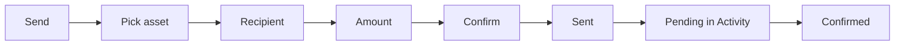

# Transfer

Send an asset to an address, a name or a contact, or pay a scanned QR code or payment link, with one confirmation screen that shows everything before it is signed.

## Send

- The user taps Send on the wallet screen or an asset and picks the asset to send.
- Recipient: the user pastes or types an address or a name, scans a QR code, or picks a contact or one of their own wallets; a name is resolved while typing, and a memo field appears on networks that use one.
- Amount: the user types in crypto or in fiat and switches between them, or taps Max, which keeps the network fee back on a native coin; the available balance is shown.
- Confirm shows the amount with its value, the recipient with its name when known, the network, the fee (with faster or slower options and a custom fee where the network allows), the wallet, and any warning from the simulation of the transaction.
- The user confirms with the device's authentication; the transaction is sent and the app returns to where Send started.
- The transaction appears at once as Pending in Activity and on the asset, is tracked until the network confirms it, and its balance updates then.

## Scanned codes and payment links

- Supported codes: a plain address; Bitcoin, Litecoin, Bitcoin Cash, Dogecoin and Zcash payment codes (amount, memo, label); XRP with a destination tag; Ethereum coin and token transfers; Solana Pay; TON transfers with a comment; WalletConnect Pay links.
- The scanner reads them from the camera or a picked image.
- A complete payment (asset, amount and, where required, memo) opens Confirm directly; a partial one opens the recipient screen for review; a plain address that matches several networks asks which asset to send.
- A WalletConnect Pay link opens a review of the merchant's request and, once confirmed, pays it and reports the result back to the merchant.

## Rules

- Nothing is signed or sent without the confirmation screen showing the amount, recipient, network and fee.
- A simulation that cannot answer never blocks sending; a simulation that finds a risk shows it before the user confirms.

## Test codes

Scan these from another device with a test wallet; do not submit the transactions. Token tests need the exact token enabled in the wallet.

Payment codes and the expected result

| | |
|---|---|
| **Bitcoin amount**  `bitcoin:bc1qw508d6qejxtdg4y5r3zarvary0c5xw7kv8f3t4?amount=0.0001` Confirm `0.0001 BTC`. | **Bitcoin address only**  `bitcoin:bc1qw508d6qejxtdg4y5r3zarvary0c5xw7kv8f3t4` Open the recipient screen. |
| **Plain EVM address**  `0x1f9090aaE28b8a3dCeaDf281B0F12828e676c326` Select an asset when multiple EVM chains match. | **Ethereum USDC**  `ethereum:0xA0b86991c6218b36c1d19D4a2e9Eb0cE3606eB48@1/transfer?address=0x1f9090aaE28b8a3dCeaDf281B0F12828e676c326&uint256=1500000` Confirm `1.5 USDC`. |
| **Solana USDC**  `solana:HA4hQMs22nCuRN7iLDBsBkboz2SnLM1WkNtzLo6xEDY5?amount=1&spl-token=EPjFWdd5AufqSSqeM2qN1xzybapC8G4wEGGkZwyTDt1v` Confirm `1 USDC`. | **XRP destination tag**  `ripple:rEb8TK3gBgk5auZkwc6sHnwrGVJH8DuaLh?amount=10&dt=12345` Confirm amount `10` with tag `12345`. |
| **Uppercase parameter keys**  `bitcoin:bc1qw508d6qejxtdg4y5r3zarvary0c5xw7kv8f3t4?AMOUNT=0.001` Confirm `0.001 BTC`; the key case is ignored. | **Bitcoin address-less URI**  `bitcoin:?bc=bc1qw508d6qejxtdg4y5r3zarvary0c5xw7kv8f3t4&amount=0.001` Confirm `0.001 BTC` from the `bc` instruction. |
| **TON comment**  `ton://transfer/UQA5olhYULHkui4mTQM0LodWG0EqUaxmK6-e3mHrCZFO2diA?amount=1000000000&text=order+7` Confirm `1 TON` with comment `order 7`. | **Excess BTC precision**  `bitcoin:bc1qw508d6qejxtdg4y5r3zarvary0c5xw7kv8f3t4?amount=0.000000001` Do not round; open recipient review. |

**Partially specified payments** open the recipient screen for review or completion.

| | |
|---|---|
| **XRP without destination tag**  `ripple:rEb8TK3gBgk5auZkwc6sHnwrGVJH8DuaLh?amount=10` Amount `10` is preserved; add a destination tag only if required. | **XRP without amount**  `ripple:rEb8TK3gBgk5auZkwc6sHnwrGVJH8DuaLh?dt=12345` Tag `12345` is preserved; enter the amount. |

**Scanner rendering**: a code must be read however it is drawn, from the camera and from a picked image alike.

| | |
|---|---|
| **Light on dark**  `bitcoin:bc1qw508d6qejxtdg4y5r3zarvary0c5xw7kv8f3t4` WalletConnect and dark-mode screenshots draw the code this way; open the recipient screen. | |

