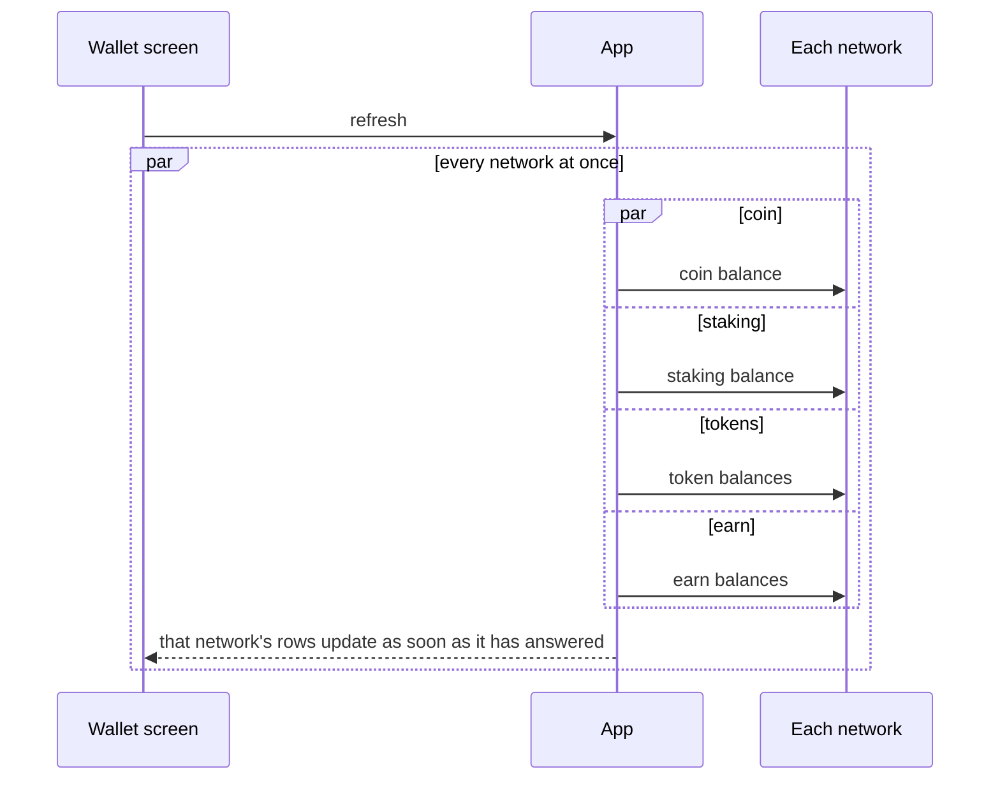
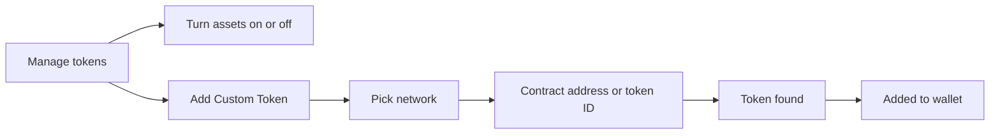

# Wallet

The home screen: what the selected wallet holds, what it is worth, and the way into every action.

## Wallet screen

- The screen opens instantly with what the app already knows: wallet name, total with its 24h change, the action buttons, the asset rows with balance, price and value, and any banner.
- The wallet and asset screens show at most one banner, the most important one; closing it brings up the next.
- Send, Receive and Buy show for every wallet that can sign; Swap where a swap is possible; a watch-only wallet shows a notice instead of buttons, on the wallet and asset screens and in an empty transaction list.
- Pinned assets come first, then the rest by value; a native coin is titled by its network.
- One switch hides balances everywhere.
- Pull-to-refresh fetches balances, discovers new tokens, and loads new transactions and NFTs, all as separate requests at the same time; prices arrive live, with no timer.
- Switching wallet rebuilds the screen for the new wallet.

## Balances

- Every network is asked at the same time, and on each network the coin, staking, token and earn balances are separate requests, so the fastest answer is never held back by the slowest.
- Each network updates the list as soon as it has answered, in one write for that network, so the fastest network shows first; unchanged rows are not touched.
- A request that fails holds nothing back: the other balances of that network still update, and a network or balance that did not answer keeps its last values.
- Prices are kept in USD and converted once to the chosen currency, so every screen shows the same value.

## Asset screen

- Tapping an asset shows its balance and value, the price with its change, the actions the asset allows (Send, Receive, Buy, Swap, Stake), its price chart and market data, its balance breakdown, and its transactions.
- The user can pin or hide the asset, open it on the explorer, share it, and set Price Alerts.
- Chart, history and market data load at the same time; the header is usable while they arrive.

## Manage tokens

- The user turns assets on or off for the wallet; a turned-off asset leaves the list and keeps its data.
- A custom token is looked up by its contract address or token ID; an unverified one shows "Know What You're Adding" before it is added.

## Search and recents

- One search covers assets, perpetuals and NFTs, grouped, and an asset the wallet does not have can be added from the result.
- Assets the user recently used appear as Recents when picking an asset, per wallet, most recent first.

## Rules

- Coin, staking, token and earn balances are separate requests; never merge them into one, because one slow or failing request must not hold back the others.
- A network that fails keeps its last values on screen; there is no "unknown" state.
- An answer always belongs to the wallet it was requested for, never the wallet on screen.
- A price or portfolio chart, or the price widget, that cannot load shows that there is no data, and only being offline shows an error, because server text is not written for users.
