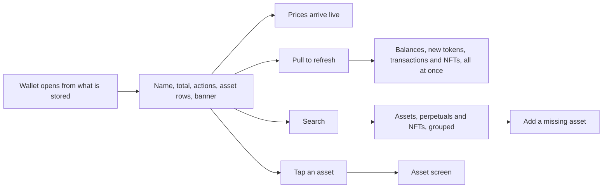
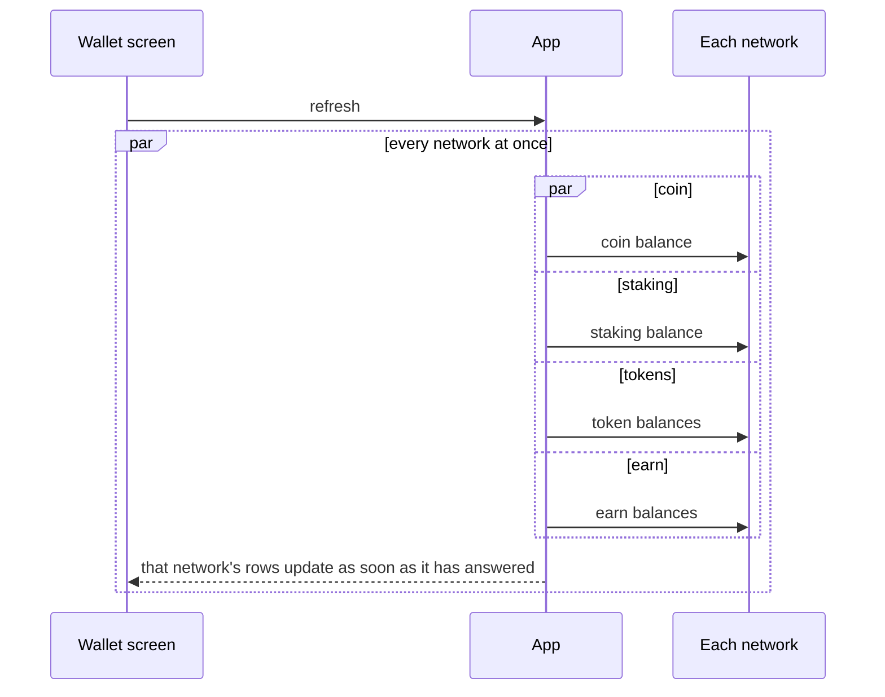
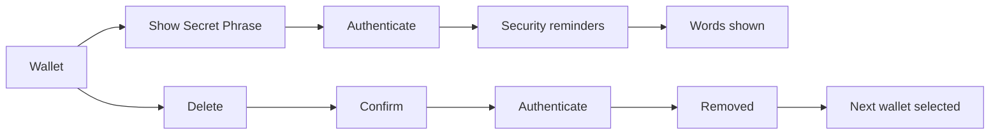

# Wallet

The home screen and the wallets themselves: what the selected wallet holds and is worth, the way into every action, and switching, pinning and managing wallets.

## Wallet screen

```mermaid
flowchart LR
    A[Wallet opens from what is stored] --> B[Name, total, actions, asset rows, banner]
    B --> C[Prices arrive live]
    B --> D[Pull to refresh] --> E[Balances, new tokens, transactions and NFTs, all at once]
    B --> F[Search] --> G[Assets, perpetuals and NFTs, grouped] --> H[Add a missing asset]
    B --> I[Tap an asset] --> J[Asset screen]
```

1. The screen opens instantly with what the app already knows: wallet name, total with its 24h change, the action buttons, the asset rows with balance, price and value, and any banner.
2. Pinned assets come first, then the rest by value.
3. Send, Receive and Buy show for every wallet that can sign, and Swap where a swap is possible.
4. Pull-to-refresh fetches balances, discovers new tokens, and loads new transactions and NFTs, all as separate requests at the same time.
5. One search covers assets, perpetuals and NFTs, grouped, and an asset the wallet does not have can be added from the result.

| When | Expected | Why |
|---|---|---|
| Several banners apply | the wallet and asset screens show at most one, the most important; closing it brings up the next | |
| The wallet's key no longer has full control of a network account | a non-dismissible warning; actions for the affected account are unavailable | the wallet must refuse transactions it cannot authorize |
| The wallet is watch-only | a notice instead of buttons, on the wallet and asset screens and in an empty transaction list; no account-control warning | it holds no key that could lose control |
| The asset is a native coin | it is titled by its network | |
| The wallet has no address on a network | none of that network's assets are listed | a network without an address has nothing to send, receive or refresh |
| The user hides balances | one switch hides them everywhere | |
| Prices change | they arrive live, with no timer | |
| The user switches wallet | the screen is rebuilt for the new wallet | |
| Search finds more assets than its preview shows | the Assets header opens the full list, also when some of the found assets are pinned | pinned rows share the fetched window, so they count toward more |

Asset logos and charts follow the shared [Asset logos](../PRODUCT.md#asset-logos) and [Charts](../PRODUCT.md#charts) sections.

## Balances

```mermaid
sequenceDiagram
    participant Screen as Wallet screen
    participant App
    participant Chain as Each network
    Screen->>App: refresh
    par every network at once
        par coin
            App->>Chain: coin balance
        and staking
            App->>Chain: staking balance
        and tokens
            App->>Chain: token balances
        and earn
            App->>Chain: earn balances
        end
        App-->>Screen: that network's rows update as soon as it has answered
    end
```

1. A refresh asks every network at the same time; on each network the coin, staking, token and earn balances are separate requests.
2. Each network updates all its rows at once, as soon as it has answered.

| When | Expected | Why |
|---|---|---|
| Networks answer at different speeds | the fastest network shows first | the fastest answer is never held back by the slowest |
| A row did not change | it is not touched | |
| One balance request fails | the other balances of that network still update | a failing request holds nothing back |
| A network or balance fails or does not answer | it keeps its last values on screen; there is no "unknown" state | |

## Wallets

Switch between wallets, pin the ones used most, and manage a wallet: name, avatar, its Secret Phrase or Private Key, and delete.

```mermaid
flowchart LR
    A[Wallet] --> B[Show Secret Phrase] --> C[Authenticate] --> D[Security reminders] --> E[Words shown]
    A --> F[Delete] --> G[Confirm] --> H[Authenticate] --> I[Removed] --> J[Next wallet selected]
```

1. Wallets lists "Create a New Wallet", "Import an Existing Wallet", then every wallet with its avatar, name and "Multi-Coin" or its address; the current one has a checkmark.
2. Tapping another wallet selects it; a long press pins it into a "Pinned" section above the rest.
3. A wallet's screen edits the name and sets an avatar from an emoji or one of its own NFTs.
4. "Show Secret Phrase" or "Show Private Key" shows the words with a Copy button.
5. Delete removes everything the wallet owned on the device.

| When | Expected | Why |
|---|---|---|
| Wallets are listed | Multi-Coin first, then single-network, then watch-only | |
| Any wallet picker opens (WalletConnect, Rewards) | the same Pinned section | |
| The user edits the name | it is saved as typed; a blank name keeps the last one | |
| The wallet has a single network | its screen shows the address with an explorer link | |
| The wallet is watch-only | no "Show Secret Phrase" or "Show Private Key" row | |
| A wallet is deleted | the app switches to the next wallet: Multi-Coin first, then the oldest | |
| The last wallet is deleted | the app returns to onboarding | |

Showing and copying a Secret Phrase or private key follow the shared [Secrets](../PRODUCT.md#secrets) section.

## Toasts

Toasts follow the shared [Toasts](../PRODUCT.md#toasts) section.

| When | Toast | Shows on |
|---|---|---|
| An asset is pinned | 📌 Pinned: Bitcoin | the wallet or search |
| An asset is unpinned | 📌 Unpinned: Bitcoin | the wallet or search |
| A token is added from search or a network's assets | ➕ Added to wallet | where it was added |
| A token is added but its balance cannot load | ❌ the reason | where it was added |

## Platform differences

| When | iOS | Android | Expected |
|---|---|---|---|
| The user finishes a search | no extra sync | syncs the balances of the assets the search found | Intentional: a one-sided feature, added to iOS only when required |

## Rules

- Coin, staking, token and earn balances are separate requests, never merged into one, because one slow or failing request must not hold back the others.
- An answer always belongs to the wallet it was requested for, never the wallet on screen.
- Prices are kept in USD and converted once to the chosen currency, so every screen shows the same value.
- While any wallet exists the app always has a selected wallet.
