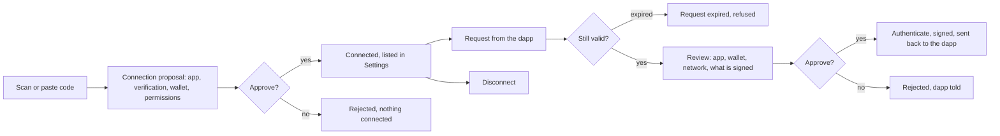

# WalletConnect

Connect the wallet to a dapp by scanning or pasting its code, then approve or reject what the dapp asks: sign a message, sign a transaction, or switch network.

1. The user scans or pastes a WalletConnect code; the proposal shows the app, its verification level, the wallet it will connect and the permissions ("View your balance and activity", "Send approval requests").
2. Approve connects the wallet; the connection appears under WalletConnect in Settings with the app, the wallet and the networks, and can be disconnected there.
3. A request from a connected dapp opens a review: the app, the wallet, the network, and the message or transaction to sign, with the same fee and simulation warnings as any transfer.
4. Approve signs it with the device's authentication and returns the result to the dapp.

## Expected results

| When | Expected | Why |
|---|---|---|
| The dapp fails verification | the proposal shows it before the user connects | |
| The user rejects a request | a refusal goes back to the dapp | |
| A request has expired | "Request expired"; it cannot be approved and is never signed | |
| A message to sign comes from a site flagged as malicious | it is refused before anything is signed | a message to sign is checked like a transaction |
| A permit to sign names a flagged spender | a critical warning on the review | |
| A WalletConnect Pay link | a payment review instead of a connection (see [Transfer](transfer.md)) | |
| A WalletConnect Pay verification page is over https on the payment's own host | it loads | |
| A WalletConnect Pay verification page is anywhere else | it opens in the browser | |
| The verification page reports a failure | it closes and the user sees an error instead of waiting on it | |

## Platform differences

| When | iOS | Android | Expected |
|---|---|---|---|
| A dapp asks to sign in with one-click authentication | not supported | supported | Intentional |

## Rules

- A request is signed only from its review screen.
