# Wallet

The home screen: what the selected wallet holds, what it is worth, and the way into every action.

## Wallet screen

1. The screen opens instantly with what the app already knows: wallet name, total with its 24h change, the action buttons, the asset rows with balance, price and value, and any banner.
2. Pinned assets come first, then the rest by value.
3. Send, Receive and Buy show for every wallet that can sign, and Swap where a swap is possible.
4. Pull-to-refresh fetches balances, discovers new tokens, and loads new transactions and NFTs, all as separate requests at the same time.
5. One search covers assets, perpetuals and NFTs, grouped, and an asset the wallet does not have can be added from the result.

| When | Expected | Why |
|---|---|---|
| Several banners apply | the wallet and asset screens show at most one, the most important; closing it brings up the next | |
| The wallet is watch-only | a notice instead of buttons, on the wallet and asset screens and in an empty transaction list | |
| The asset is a native coin | it is titled by its network | |
| The wallet has no address on a network | none of that network's assets are listed | a network without an address has nothing to send, receive or refresh |
| The user hides balances | one switch hides them everywhere | |
| Prices change | they arrive live, with no timer | |
| The user switches wallet | the screen is rebuilt for the new wallet | |
| A portfolio chart or the price widget cannot load | it shows that there is no data; only being offline shows an error | server text is not written for users |

## Balances

```mermaid
sequenceDiagram
    participant Screen as Wallet screen
    participant App
    participant Chain as Each network
    Screen->>App: refresh
    par every network at once
        par coin
            App->>Chain: coin balance
        and staking
            App->>Chain: staking balance
        and tokens
            App->>Chain: token balances
        and earn
            App->>Chain: earn balances
        end
        App-->>Screen: that network's rows update as soon as it has answered
    end
```

1. A refresh asks every network at the same time; on each network the coin, staking, token and earn balances are separate requests.
2. Each network updates all its rows at once, as soon as it has answered.

| When | Expected | Why |
|---|---|---|
| Networks answer at different speeds | the fastest network shows first | the fastest answer is never held back by the slowest |
| A row did not change | it is not touched | |
| One balance request fails | the other balances of that network still update | a failing request holds nothing back |
| A network or balance fails or does not answer | it keeps its last values on screen; there is no "unknown" state | |

## Platform differences

| When | iOS | Android | Expected |
|---|---|---|---|
| The user finishes a search | no extra sync | syncs the balances of the assets the search found | Intentional: a one-sided feature, added to iOS only when required |

## Rules

- Coin, staking, token and earn balances are separate requests, never merged into one, because one slow or failing request must not hold back the others.
- An answer always belongs to the wallet it was requested for, never the wallet on screen.
- Prices are kept in USD and converted once to the chosen currency, so every screen shows the same value.
