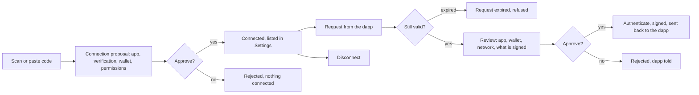

# WalletConnect

Connect the wallet to a dapp by scanning or pasting its code, then approve or reject what the dapp asks: sign a message, sign a transaction, or switch network.

- The user scans or pastes a WalletConnect code; the proposal shows the app, its verification level, the wallet it will connect and the permissions ("View your balance and activity", "Send approval requests").
- Approve connects the wallet; the connection appears under WalletConnect in Settings with the app, the wallet and the networks, and can be disconnected there.
- A request from a connected dapp opens a review: the app, the wallet, the network, and the message or transaction to sign, with the same fee and simulation warnings as any transfer.
- Approve signs it with the device's authentication and returns the result to the dapp; Reject returns a refusal.
- A request that has expired reads "Request expired" and cannot be approved.
- A WalletConnect Pay link opens a payment review instead of a connection (see [Transfer](transfer.md)).

## Rules

- A request is signed only from its review screen, and an expired request is never signed.
- A dapp that fails verification is shown as such before the user connects.
- A WalletConnect Pay verification page loads only over https on the payment's own host; anything else opens in the browser.
- A message to sign is checked like a transaction: a site flagged as malicious is refused before anything is signed, and a flagged spender in a permit shows a critical warning on the review.
