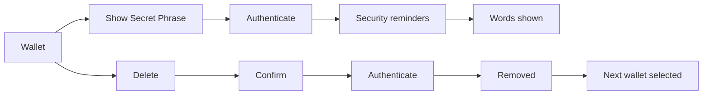

# Wallets

Switch between wallets, pin the ones used most, and manage a wallet: name, avatar, its Secret Phrase or Private Key, and delete.

- Wallets lists "Create a New Wallet", "Import an Existing Wallet", then every wallet with its avatar, name and "Multi-Coin" or its address; the current one has a checkmark, and tapping another selects it.
- A long press pins a wallet into a "Pinned" section above the rest; wallets are ordered Multi-Coin first, then single-network, then watch-only. Every wallet picker (WalletConnect, Rewards) shows the same Pinned section.
- A wallet's screen edits the name (saved as typed; a blank name keeps the last one), sets an avatar from an emoji or one of its own NFTs, and shows the address with an explorer link for a single-network wallet.
- "Show Secret Phrase" or "Show Private Key" shows the words with a Copy button; a watch-only wallet has no such row.
- Delete removes everything the wallet owned on the device and switches to the next wallet (Multi-Coin first, then the oldest); when none is left the app returns to onboarding.

## Rules

- While any wallet exists the app always has a selected wallet.
- A copied Secret Phrase or private key leaves the clipboard after one minute and is kept off other devices, and whatever the user copies after it stays; an address or any other copy stays until something replaces it, because only a secret is dangerous to leave behind.
