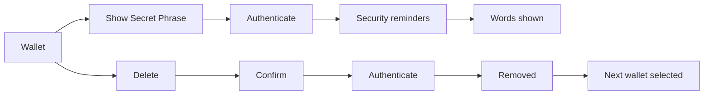

# Wallets

Switch between wallets, pin the ones used most, and manage a wallet: name, avatar, its Secret Phrase or Private Key, and delete.

1. Wallets lists "Create a New Wallet", "Import an Existing Wallet", then every wallet with its avatar, name and "Multi-Coin" or its address; the current one has a checkmark.
2. Tapping another wallet selects it; a long press pins it into a "Pinned" section above the rest.
3. A wallet's screen edits the name and sets an avatar from an emoji or one of its own NFTs.
4. "Show Secret Phrase" or "Show Private Key" shows the words with a Copy button.
5. Delete removes everything the wallet owned on the device.

## Expected results

| When | Expected | Why |
|---|---|---|
| Wallets are listed | Multi-Coin first, then single-network, then watch-only | |
| Any wallet picker opens (WalletConnect, Rewards) | the same Pinned section | |
| The user edits the name | it is saved as typed; a blank name keeps the last one | |
| The wallet has a single network | its screen shows the address with an explorer link | |
| The wallet is watch-only | no "Show Secret Phrase" or "Show Private Key" row | |
| The user copies the Secret Phrase or private key | it leaves the clipboard after one minute and is kept off other devices; whatever the user copies after it stays | only a secret is dangerous to leave behind |
| The user copies an address or anything else | it stays until something replaces it | only a secret is dangerous to leave behind |
| A wallet is deleted | the app switches to the next wallet: Multi-Coin first, then the oldest | |
| The last wallet is deleted | the app returns to onboarding | |

## Platform differences

None recorded.

## Rules

- While any wallet exists the app always has a selected wallet.
